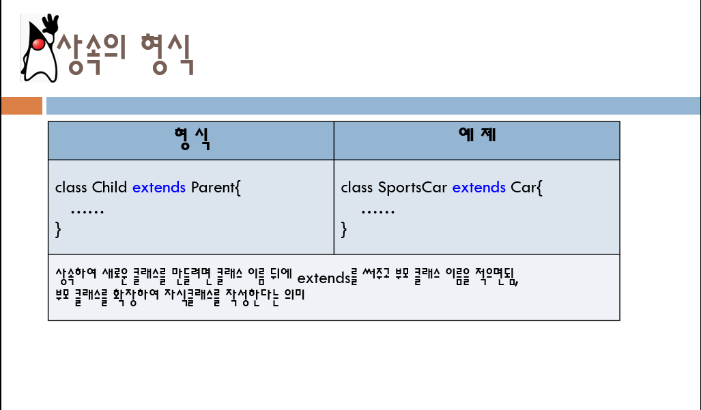

# java
자바코드저장소

상속의 정의

첫번째 과제

이름 나이 몸무게 전화번호 입력받고 출력하기

[HW1](./HW1_1.java)

두번째 과제

random함수를 이용한 컴퓨터숫자 맞추기

[HW2](./HW2_2.java)

세번째 과제

implements를 활용한 버스 좌석 예약

[HW3](./HW3_3.java)

네번째 과제

text 파일에서 내용 불러오기

[HW4](./HW4_4.java)

Final project

스마트형 냉장고 만들기

[Final Project](./Project.zip)
